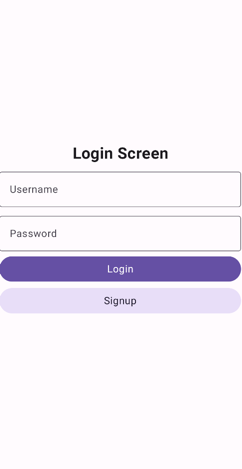
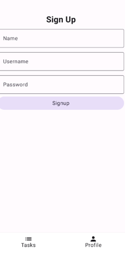
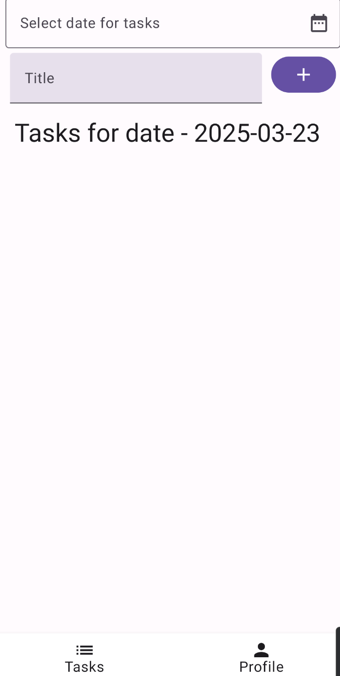
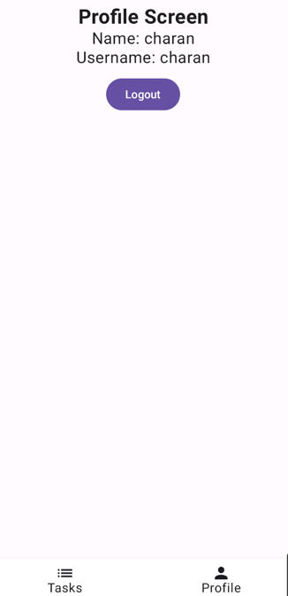

# 📌 Todo App

Welcome to the **Todo App**! This app helps you manage your daily tasks efficiently with a simple and intuitive interface.

## 📱 Screens in Mobile

Below are the main screens of the app:

<table>
  <tr>
    <td align="center"><b>🔑 Login Screen</b></td>
    <td align="center"><b>📝 Register Screen</b></td>
  </tr>
  <tr>
    <td></td>
    <td></td>
  </tr>
  <tr>
    <td align="center"><b>✅ Tasks Screen</b></td>
    <td align="center"><b>👤 Profile Screen</b></td>
  </tr>
  <tr>
    <td></td>
    <td></td>
  </tr>
</table>

## 🚀 Features
- User authentication (Login & Register)
- Task management (Add, Edit, Delete tasks)
- User profile management

## 📂 Project Structure
```
📦 TodoApp
 ┣ 📂 app
 ┃ ┣ 📂 src
 ┃ ┣ 📂 ui
 ┃ ┣ 📂 assets
 ┣ 📜 README.md
 ┣ 📜 build.gradle
 ┣ 📜 AndroidManifest.xml
```

## 🔧 Installation
1. Clone the repository:
   ```sh
   git clone https://github.com/your-username/todo-app.git
   ```
2. Open the project in **Android Studio**.
3. Build the APK:
   ```sh
   ./gradlew assembleDebug
   ```
4. Install the APK on your device:
   ```sh
   adb install app/build/outputs/apk/debug/app-debug.apk
